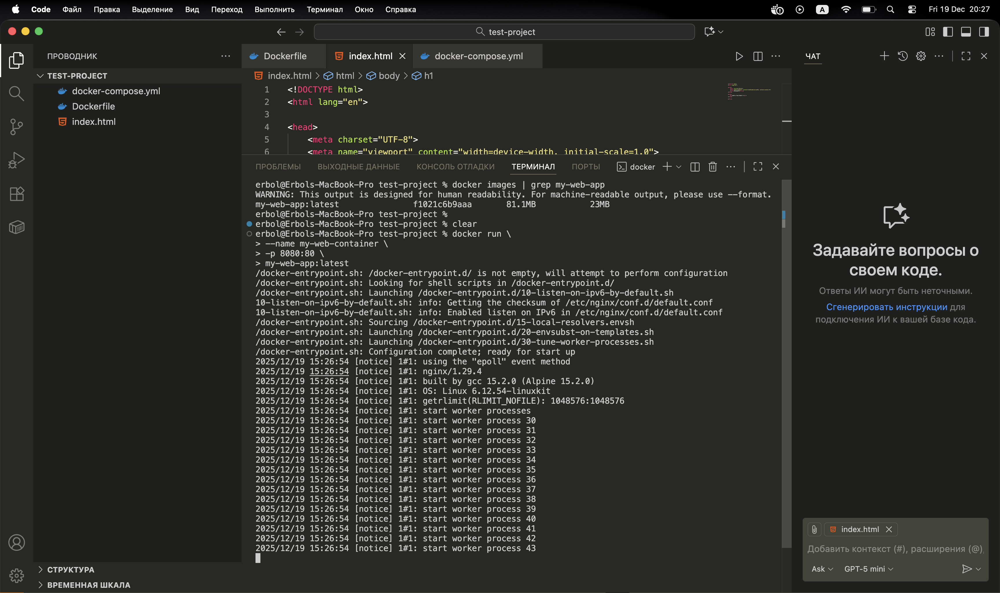
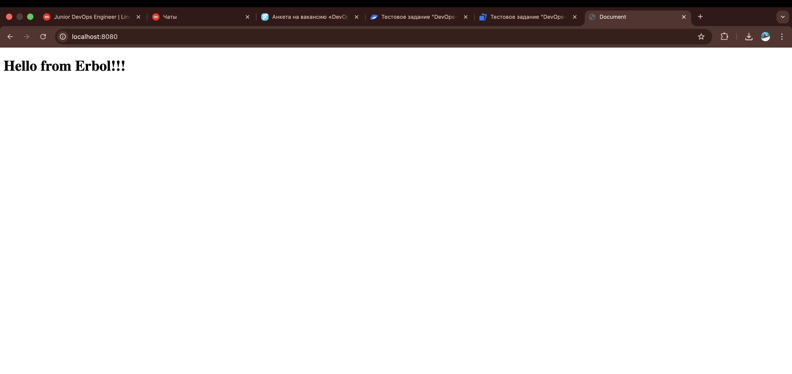

---

## 📄 index.html

Простая HTML-страница, которая отображается в браузере.

```html
<h1>Hello from Erbol</h1>
```
Docker-образ собран на базе nginx:alpine.
HTML-файл копируется в стандартный web-root nginx.

FROM nginx:alpine
COPY index.html /usr/share/nginx/html/index.html


## Сборка Docker-образа

docker build -t my-web-app:latest .


## Скриншот результата сборки образа:

# docker build ...
# (сохранить скриншот и добавить ниже)


## Запуск контейнер (через docker run)



## Приложение доступно по адресу:


http://localhost:8080





## Docker Compose

Для запуска сервиса используется docker-compose.yml.


version: "3.9"

services:
  web:
    image: my-web-app:latest
    ports:
      - "8080:80"


Запуск:

docker compose up -d


Скриншот работающего сервиса:

![Docker Compose](./pics/docker_compose.jpeg
